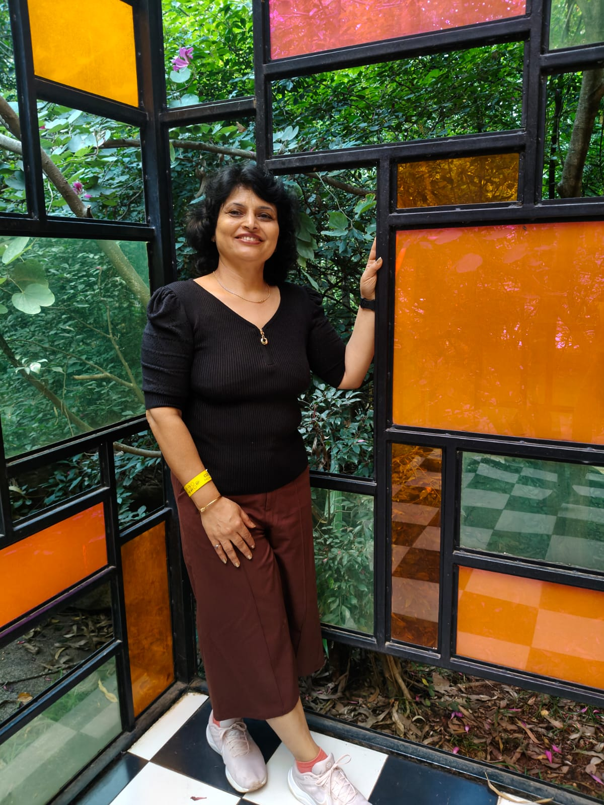

# Seema Paintings — Website

A clean, elegant multi-page static website for **Seema C.**, built for GitHub Pages.

---

## File Structure

```
Seema-paintings/
│
├── index.html          ← Home page
├── about.html          ← About Me
├── works.html          ← My Works
├── students.html       ← Students' Works
├── contact.html        ← Get in Touch
│
├── css/
│   └── style.css       ← All styles (one shared file)
│
├── js/
│   └── main.js         ← Nav toggle, thumbnail switcher, form feedback
│
└── images/
    ├── hero.jpg                   ← Hero photo (portrait orientation)
    ├── portrait.jpg               ← About Me portrait
    ├── works/
    │   ├── lagoon-memoirs-main.jpg
    │   ├── lagoon-memoirs-d1.jpg
    │   ├── lagoon-memoirs-d2.jpg
    │   └── ...                    ← One main + up to 2 details per work
    └── students/
        ├── student1-main.jpg
        └── ...
```

---

## Deploying to GitHub Pages

1. Create a new GitHub repository (e.g. `Seema-paintings`).
2. Upload all files maintaining the folder structure above.
3. Go to **Settings → Pages** → Source: **main branch / root**.
4. Your site will be live at `https://yourusername.github.io/Seema-paintings/`.

---

## Adding Your Photos

### Hero image (`index.html`)
Replace the placeholder `<div>` in the hero section with:
```html

```

### About portrait (`about.html`)
```html

```

### Adding a new artwork (`works.html` or `students.html`)

Copy this block and paste it after the last `<div class="artwork-separator"></div>`:

```html
<div class="artwork-item">
  <div class="artwork-item__images">
    
    <div class="artwork-item__thumbs">
      
      
    </div>
  </div>
  <div class="artwork-item__info">
    <h2 class="artwork-item__title">Your Title</h2>
    <p class="artwork-item__meta">Acrylic on Canvas · 48″ × 33″</p>
    <div class="divider"></div>
    <p class="artwork-item__desc">Your description here.</p>
  </div>
</div>

<div class="artwork-separator"></div>
```

> **Tip:** Images alternate left/right automatically (every even-numbered work flips sides) — no extra CSS needed.

---

## Enabling the Contact Form

The contact form currently shows a success message on submit (client-side only).
To actually receive emails from GitHub Pages, use one of these free services:

### Option A — Formspree (recommended, free tier)
1. Sign up at [formspree.io](https://formspree.io).
2. Create a form and get your form ID.
3. In `contact.html`, change the `<form>` tag to:
   ```html
   <form action="https://formspree.io/f/YOUR_FORM_ID" method="POST">
   ```
4. Remove the JS submit listener in `main.js` (the `contact-form` block).

### Option B — EmailJS (no backend needed)
Follow the EmailJS docs to send email directly from JavaScript.

---

## Customisation Checklist

- [ ] Replace all `[ placeholder ]` text in HTML files with your real content
- [ ] Add your photos to the `images/` folder and update `src` attributes
- [ ] Update name, email, phone, and Instagram in `contact.html`
- [ ] Update the stats (years, exhibitions, students) in `about.html`
- [ ] Update the copyright year in all five footers if needed
- [ ] Set up Formspree (or similar) for the contact form
